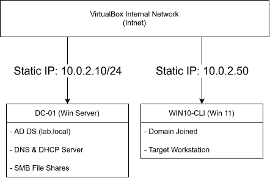
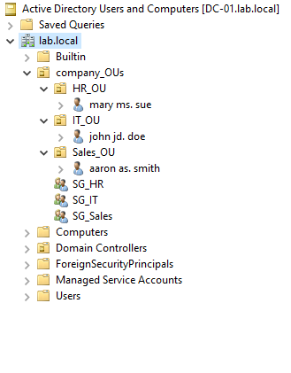

# Active-Directory-Office-Lab

# Windows Server 2022 & Windows 11 Active Directory Mini-Office Lab

## Executive Summary
This project demonstrates the design, deployment, and administration of an enterprise-style Active Directory Domain Services (AD DS) environment using VirtualBox. 

The goal of this lab was to simulate a small office IT infrastructure from scratch—configuring network services (DNS, DHCP), implementing Organizational Units (OUs), enforcing Group Policies (GPOs), establishing secured network file shares, and executing Tier 1/2 Helpdesk administrative tasks.

---

## Network Topology & Lab Specifications

- **Hypervisor:** Oracle VM VirtualBox
- **Network Mode:** Isolated Internal Virtual Network (`intnet`)
- **Domain Controller (DC-01):** Windows Server 2022 Standard (`10.0.2.10/24`)
- **Client Workstation (WIN10-CLI):** Windows 11 Enterprise (DHCP / Static `10.0.2.50/24`)
- **Domain Name:** `lab.local`

---

## Core Skills & Concepts Demonstrated

- **Active Directory Domain Services (AD DS):** Forest deployment, domain promotion, and object hierarchy design.
- **Identity & Access Management (IAM):** OU structuring (`IT`, `Sales`, `HR`), security group creation (`SG_Sales`, `SG_HR`), and user provisioning.
- **Group Policy Management (GPO):** Enforcing domain password rules, automated drive mapping via GPO preferences, and Administrative Template restrictions.
- **Network Infrastructure Services:** Static IP assignment, DNS forwarding, DHCP scope creation, and subnet isolation.
- **Storage & Security:** SMB share deployment (`Sales_Data`), Share permissions vs. NTFS security ACL configuration.
- **Helpdesk Operations:** User password resets, account lockout enforcement, and unlock procedures.

---

## Key Deployments & Configurations

### 1. Active Directory OU & Security Group Structure
Created a structured directory tree under `company_OUs` to segregate departments and apply targeted GPOs.
- **OUs:** `IT_OU`, `Sales_OU`, `HR_OU`
- **Security Groups:** `SG_IT`, `SG_Sales`, `SG_HR`
- **Users:** Provisioned test domain accounts (e.g., `jdoe`, `aaron`).

---

## Key Deployments & Configurations

### 1. Active Directory OU & Security Group Structure
Created a structured directory tree under `company_OUs` to segregate departments and apply targeted GPOs.
- **OUs:** `IT_OU`, `Sales_OU`, `HR_OU`
- **Security Groups:** `SG_IT`, `SG_Sales`, `SG_HR`
- **Users:** Provisioned test domain accounts (e.g., `jdoe`, `aaron`).

### 2. Group Policy Configurations
| Policy Name | Target OU | Setting / Path | Functional Goal |
| :--- | :--- | :--- | :--- |
| **Default Domain Policy** | `lab.local` (Domain) | Account Lockout Threshold = 3 attempts | Mitigate brute-force attacks |
| **GPO_Sales_Drive** | `Sales_OU` | User Config > Preferences > Drive Maps (`S:` -> `\\DC-01\Sales_Data`) | Auto-mount network share on login |
| **GPO_Block_Control_Panel** | `Sales_OU` | User Config > Policies > Admin Templates > Control Panel | Restrict standard user system access |

### 3. File Share & Permission Matrix
Configured SMB folder sharing for department data access control:
- **Share Location:** `\\DC-01\Sales_Data`
- **Share Permissions:** `SG_Sales` - Full Control | `Everyone` - Removed
- **NTFS Permissions:** `SG_Sales` - Modify Access
