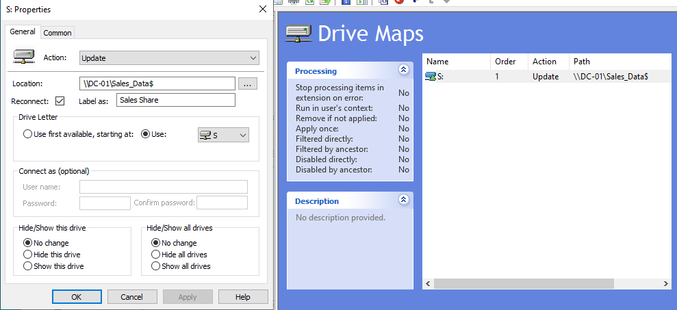
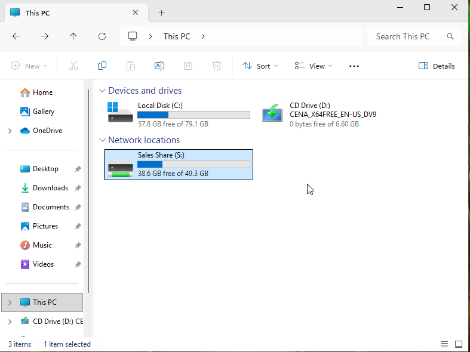
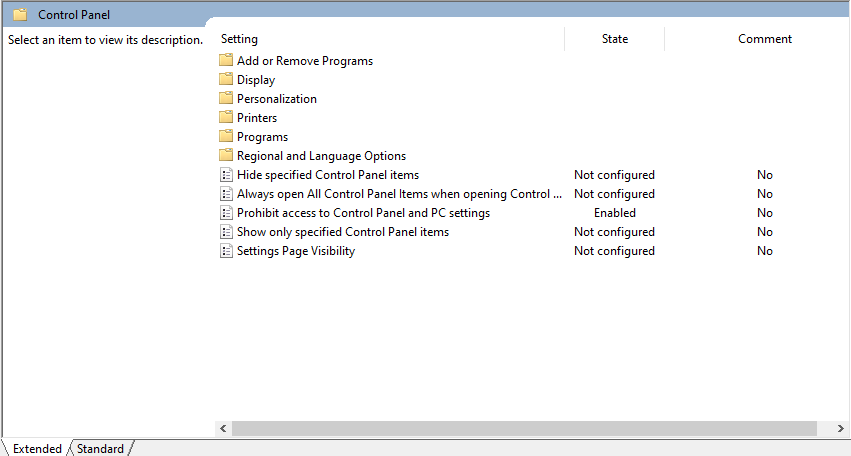
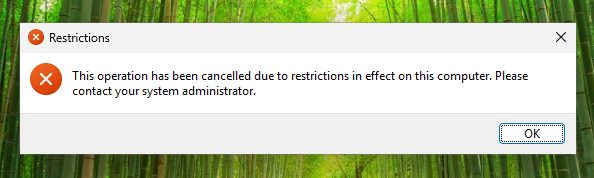

# Active-Directory-Office-Lab

# Windows Server 2022 & Windows 11 Active Directory Mini-Office Lab

## Executive Summary
This project demonstrates the design, deployment, and administration of an enterprise-style Active Directory Domain Services (AD DS) environment using VirtualBox. 

The goal of this lab was to simulate a small office IT infrastructure from scratch—configuring network services (DNS, DHCP), implementing Organizational Units (OUs), enforcing Group Policies (GPOs), establishing secured network file shares, and executing Tier 1/2 Helpdesk administrative tasks.

---

## Network Topology & Lab Specifications

- **Hypervisor:** Oracle VM VirtualBox
- **Network Mode:** Isolated Internal Virtual Network (`intnet`)
- **Domain Controller (DC-01):** Windows Server 2022 Standard (`10.0.2.10/24`)
- **Client Workstation (WIN10-CLI):** Windows 11 Enterprise (DHCP / Static `10.0.2.50/24`)
- **Domain Name:** `lab.local`

---

## Core Skills & Concepts Demonstrated

- **Active Directory Domain Services (AD DS):** Forest deployment, domain promotion, and object hierarchy design.
- **Identity & Access Management (IAM):** OU structuring (`IT`, `Sales`, `HR`), security group creation (`SG_Sales`, `SG_HR`), and user provisioning.
- **Group Policy Management (GPO):** Enforcing domain password rules, automated drive mapping via GPO preferences, and Administrative Template restrictions.
- **Network Infrastructure Services:** Static IP assignment, DNS forwarding, DHCP scope creation, and subnet isolation.
- **Storage & Security:** SMB share deployment (`Sales_Data`), Share permissions vs. NTFS security ACL configuration.
- **Helpdesk Operations:** User password resets, account lockout enforcement, and unlock procedures.

---

## Key Deployments & Configurations

### 1. Active Directory OU & Security Group Structure
Created a structured directory tree under `company_OUs` to segregate departments and apply targeted GPOs.
- **OUs:** `IT_OU`, `Sales_OU`, `HR_OU`
- **Security Groups:** `SG_IT`, `SG_Sales`, `SG_HR`
- **Users:** Provisioned test domain accounts (e.g., `jdoe`, `aaron`).

---

## Key Deployments & Configurations

### 1. Active Directory OU & Security Group Structure
Created a structured directory tree under `company_OUs` to segregate departments and apply targeted GPOs.
- **OUs:** `IT_OU`, `Sales_OU`, `HR_OU`
- **Security Groups:** `SG_IT`, `SG_Sales`, `SG_HR`
- **Users:** Provisioned test domain accounts (e.g., `jdoe`, `aaron`).

### 2. Group Policy Configurations
| Policy Name | Target OU | Setting / Path | Functional Goal |
| :--- | :--- | :--- | :--- |
| **Default Domain Policy** | `lab.local` (Domain) | Account Lockout Threshold = 3 attempts | Mitigate brute-force attacks |
| **GPO_Sales_Drive** | `Sales_OU` | User Config > Preferences > Drive Maps (`S:` -> `\\DC-01\Sales_Data$`) | Auto-mount network share on login |
| **GPO_Block_Control_Panel** | `Sales_OU` | User Config > Policies > Admin Templates > Control Panel | Restrict standard user system access |

### 3. File Share & Permission Matrix
Configured SMB folder sharing for department data access control:
- **Share Location:** `\\DC-01\Sales_Data$`
- **Share Permissions:** `SG_Sales` - Full Control | `Everyone` - Removed
- **NTFS Permissions:** `SG_Sales` - Modify Access

---

## Verification & Helpdesk Operations

### Feature Test 1: GPO Enforcement & Drive Mapping
Logged into `WIN10-CLI` as domain user `LAB\aaron`:
1. **Drive Mapping:** Network drive `S:` automatically mounted in File Explorer pointing to `\\DC-01\Sales_Data`.
2. **Control Panel Restriction:** Attempted opening Control Panel via `Win + R` -> `control`. Access was successfully blocked by Group Policy.

### Feature Test 2: Account Lockout & Password Reset
1. Simulated a brute-force / forgotten password scenario on `WIN10-CLI` by entering bad credentials 3 times.
2. Verified the account became locked out with the native Windows restriction message.
3. Connected to `DC-01`, opened `dsa.msc`, located `aaron`, checked **Unlock Account**, and performed a mandatory password reset.

| Account Locked Error | Admin Unlock on DC-01 |
| :---: | :---: |
|  |  |

---

## Troubleshooting & Real-World Issues Handled

> **This section details technical hurdles encountered during deployment and how they were resolved.**

### Challenge 1: Windows Server Installation License Error
- **Symptom:** VirtualBox failed installation with `Windows cannot find the Microsoft Software License Terms`.
- **Root Cause:** VirtualBox automatically enabled Unattended Installation, injecting a broken setup script into the evaluation ISO.
- **Resolution:** Re-created the VM and enabled **Skip Unattended Installation** during initial setup.

### Challenge 2: Network Unreachable Between Workstation and DC (APIPA `169.254.x.x`)
- **Symptom:** Client VM could not receive an IP address via DHCP and domain joins failed.
- **Root Cause:** VirtualBox's host-level `NAT Network` driver on Windows 11 dropped guest-to-guest broadcast traffic, resulting in empty DHCP bindings.
- **Resolution:** Pivoted both VMs from `NAT Network` to a dedicated **Internal Network** (`intnet`) with **Promiscuous Mode: Allow All**, restoring direct L2 communication.

### Challenge 3: Account Logon Spinning / Timeout on Windows 11 Client
- **Symptom:** Domain user login spun endlessly on the Windows 11 welcome screen before reporting bad credentials.
- **Root Cause:** Active Directory account option `User must change password at next logon` conflicts with standard local domain sign-ins on unmanaged Win 11 clients.
- **Resolution:** Unchecked forced password change requirement in AD, set `Password never expires`, and verified smooth authentication.
